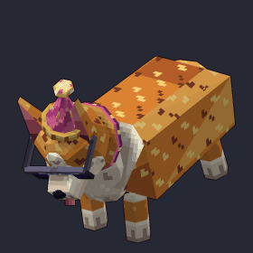
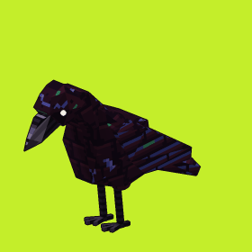
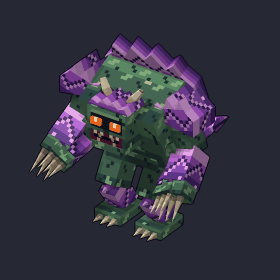
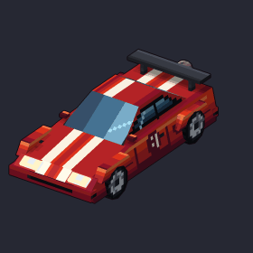
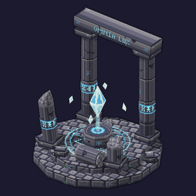
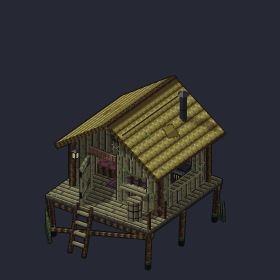

# Low-Poly 3D models

Low-Poly builds real low-poly 3D models with hand-painted pixel-art textures from a
prompt, up to 4 reference images, or both. Every texture pixel is the same size on
every face, so models look like pixel art from any angle. You can revise a model,
animate it, and export it for your engine or modeling tool.

Base URL: `https://api.retrodiffusion.ai/v2/lowpoly` (also `/v1/lowpoly`). Authenticate
with the `X-RD-Token` header, like every other endpoint.

<table>
  <tr>
    <td></td>
    <td></td>
    <td></td>
  </tr>
  <tr>
    <td></td>
    <td></td>
    <td></td>
  </tr>
</table>

Runnable clients:

- [`13_lowpoly_model.py`](example-scripts/13_lowpoly_model.py): prompt → model → animation → Godot export
- [`14_lowpoly_from_references.py`](example-scripts/14_lowpoly_from_references.py): reference photos → blocky
  model → revision → Blockbench and Minecraft exports
- [`lowpoly_model.mjs`](example-scripts/lowpoly_model.mjs): Node.js, no dependencies → `.glb` + MP4

Step-by-step requests for every endpoint are in [Examples](#examples).

## Sizes and prices

A model's size is its largest dimension in texels. Pick a size or send `"auto"`:
auto reads the prompt and picks the size that fits the object (a coin is small, a
castle is large). Requests with only reference images default to 64.

| Size | Typical subject | Generate | Revise | Animate |
| --- | --- | --- | --- | --- |
| 16 | small item: coin, potion, key | $0.25 | $0.20 | $0.15 |
| 32 | prop or handheld: sword, chair, chest | $0.50 | $0.35 | $0.25 |
| 64 | character, creature or vehicle | $0.85 | $0.65 | $0.35 |
| 128 | building or large vehicle | $1.20 | $0.90 | $0.50 |
| 256 | landmark or scene | $3.00 | $1.50 | $1.00 |

Rigging is free: it happens automatically with a model's first animation. Size
suggestions, estimates, reads and exports are free. A failed job is refunded
automatically. `GET /lowpoly/pricing` returns this table, the styles, the limits and
the export targets as JSON.

## Styles and modes

- `rd_lowpoly__detailed` (default): free-form low-poly shapes (boxes, cylinders,
  spheres, extrusions).
- `rd_lowpoly__blocky`: boxes only, like a Minecraft model. Boxes stay rectangular but
  may be tilted to any angle (a windshield, a roof). Best for Blockbench and Minecraft
  exports.

The style list can grow; `GET /lowpoly/pricing` returns the current styles (`id`, `name`,
`description`, `appearance`). Sending a Low-Poly style to `/inferences` returns
`400 lowpoly_style_not_supported`.

`mode` is `quality` (default) or `fast` (about 3x quicker, simpler shapes). Both cost
the same.

## Jobs take minutes

Generate, revise and animate are asynchronous. Each returns `202 Accepted` with a
`task_id` and the model's `asset_id`; poll `GET /lowpoly/tasks/{task_id}` every 10-20
seconds. Jobs usually take 1-5 minutes and can take up to 15 at size 256. Send an
`Idempotency-Key` header (or `custom_id` in the body) on paid calls so a retried
request returns the same job instead of charging again. A model runs one job at a
time, and an account runs a few at once (`429 lowpoly_too_many_jobs` otherwise).

```text
POST /lowpoly/generate          {prompt?, size?, style?, mode?, reference_images?, input_palette?, custom_id?}
POST /lowpoly/assets/{id}/revise   {prompt, version?, mode?, reference_images?, custom_id?}
POST /lowpoly/assets/{id}/animate  {prompt, version?, mode?, animation?, custom_id?}
GET  /lowpoly/tasks/{task_id}   -> {status: pending|running|succeeded|failed, result?, animation?, error?}
```

Prompts are at most 250 characters. `reference_images` are base64 PNG, JPEG or WEBP
(data URIs are fine), at most 4 and 8 MB each; several views of the same object
work best.

`input_palette` is a palette image (base64, like `input_palette` on `/inferences`, e.g. a
Lospec palette PNG): the model is built with only its colors (up to 256; bigger images
are reduced), and every texture pixel is locked to them. Revisions and animations keep
the palette. An unreadable image returns `400 lowpoly_invalid_palette`.

## Versions and animations

A model starts at version 1. Each revision saves a new version, and you can revise
or animate any version (`version`, default the newest). Animations attach to the
version they were made on and never create a version.

`DELETE /lowpoly/assets/{id}/versions/{number}/animations/{name}` removes one animation
from a version (free) and returns the model. The rig stays, so animating again needs no
new rig.

To change an existing animation instead of adding one, send its name as `animation`
with a prompt describing the change (`{"prompt": "slower, with a bigger hop",
"animation": "hop"}`). It is updated in place, keeps its name, and costs the same
as a new animation. An unknown name returns `404 lowpoly_animation_not_found`. A succeeded task's `result`
is the model:

```json
{
  "asset_id": "5b0c...",
  "status": "ready",
  "prompt": "a wooden treasure chest with iron bands",
  "style": "rd_lowpoly__detailed",
  "size": 32,
  "size_source": "auto",
  "versions": [
    {
      "number": 1,
      "kind": "generate",
      "render_url": "https://.../render.png",
      "turntable_url": "https://.../turntable.png",
      "scene_url": "https://.../scene.json",
      "animations": ["idle"],
      "rigged": true,
      "stats": {"size_px": [30.0, 24.0, 22.0], "triangles": 412}
    }
  ]
}
```

`GET /lowpoly/assets` lists your models (newest first, `limit`, `before_id`) and
`GET /lowpoly/assets/{id}` returns one. `scene_url` is the payload for Retro
Diffusion's interactive web viewer; use exports for your own tools.

## Recoloring

`POST /lowpoly/assets/{id}/recolor` runs the image canvas's color tools on a model's
texture atlas and saves the result as a new version (the response is the model). Later
revisions and animations keep the new colors.

| `tool` | Settings | Price |
| --- | --- | --- |
| `color_reducer` | `color_count` (2-256, omit for automatic), `dither_mode`, `dither_strength` | free |
| `palette_converter` | `palette_image` (base64), `dither_mode`, `dither_strength` | free |
| `color_style_transfer` | `reference_image` (base64) | $0.01 |

`dither_mode` is `none` (default), `bayer_2x2`, `bayer_4x4` or `bayer_8x8`; `dither_strength`
is 0-10 (default 5). `version` picks the version to recolor (default the newest). A reducer
or converter also fixes the model's palette to the new colors, so revisions keep to them.

```bash
curl -X POST https://api.retrodiffusion.ai/v2/lowpoly/assets/5b0c.../recolor \
  -H "X-RD-Token: YOUR_API_KEY" -H "Content-Type: application/json" \
  -d '{"tool": "color_reducer", "color_count": 16, "dither_mode": "bayer_4x4"}'
```

## Exports

`POST /lowpoly/assets/{id}/export {target, version?, animation?}` returns a hosted
download URL. Exports are built on first request and reused after that.

| target | File |
| --- | --- |
| `godot`, `unity`, `unreal`, `web`, `blender` | `.glb` (glTF 2.0, one node per part, nearest-filtered atlas; animated models get a bone node tree and every animation as a glTF animation) |
| `blockbench` | `.bbmodel` Blockbench project (animated models: bone groups plus every animation) |
| `obj` | zip of `.obj` + `.mtl` + atlas `.png` |
| `minecraft` | Java resource-pack zip (box parts only; best with the blocky style). Boxes tilted at angles vanilla models can't express use free element rotation (Minecraft 1.21.11+) |
| `atlas` | texture atlas `.png` |
| `turntable` | 8-view turntable sprite sheet `.png` |
| `gif`, `sheet` | an animation as a GIF or sprite sheet; omit `animation` to get every animation in one zip |
| `mp4` | an animation as a 1024x1024, 30 fps H.264 video; loops repeat to at least 4 seconds (needs `animation`) |

## Examples

Every call below uses `X-RD-Token: YOUR_API_KEY`. Paid calls (generate, revise, animate)
take an `Idempotency-Key`: generate one per call, persist it, and reuse it only to retry
that same call.

**Build a model from a prompt** (`size` "auto" picks the size from the prompt):

```bash
curl -X POST https://api.retrodiffusion.ai/v2/lowpoly/generate \
  -H "X-RD-Token: YOUR_API_KEY" -H "Content-Type: application/json" -H "Idempotency-Key: $(uuidgen)" \
  -d '{"prompt": "a mossy stone well with a little wooden roof", "size": "auto", "style": "rd_lowpoly__detailed"}'
```

```json
{"status": "accepted", "task_id": "3f1c...", "request_id": "3f1c...", "asset_id": "5b0c...",
 "operation": "generate", "cost": 0.5, "size": 32, "size_source": "auto", "message": "..."}
```

**Poll the job** every 10-20 seconds until it succeeds (the model is in `result`) or fails
(refunded):

```bash
curl https://api.retrodiffusion.ai/v2/lowpoly/tasks/3f1c... -H "X-RD-Token: YOUR_API_KEY"
```

**Build from reference images** (base64 or data URIs; several views of one object work best).
A prompt is optional; image-only requests default to size 64:

```bash
curl -X POST https://api.retrodiffusion.ai/v2/lowpoly/generate \
  -H "X-RD-Token: YOUR_API_KEY" -H "Content-Type: application/json" -H "Idempotency-Key: $(uuidgen)" \
  -d '{"reference_images": ["data:image/png;base64,iVBOR...", "data:image/png;base64,iVBOR..."],
       "prompt": "a red sports car", "style": "rd_lowpoly__blocky", "size": 64}'
```

**Revise** (saves a new version; `version` picks which one to change, default the newest):

```bash
curl -X POST https://api.retrodiffusion.ai/v2/lowpoly/assets/5b0c.../revise \
  -H "X-RD-Token: YOUR_API_KEY" -H "Content-Type: application/json" -H "Idempotency-Key: $(uuidgen)" \
  -d '{"prompt": "make the roof red and add a bucket on a rope"}'
```

**Animate**, then **change that animation** (send its name; it keeps the name and costs the
same). The succeeded task's `animation` is the new animation's name:

```bash
curl -X POST https://api.retrodiffusion.ai/v2/lowpoly/assets/5b0c.../animate \
  -H "X-RD-Token: YOUR_API_KEY" -H "Content-Type: application/json" -H "Idempotency-Key: $(uuidgen)" \
  -d '{"prompt": "the bucket swings in the wind"}'
# ... task succeeded: {"status": "succeeded", "animation": "bucket_swing", "result": {...}}

curl -X POST https://api.retrodiffusion.ai/v2/lowpoly/assets/5b0c.../animate \
  -H "X-RD-Token: YOUR_API_KEY" -H "Content-Type: application/json" -H "Idempotency-Key: $(uuidgen)" \
  -d '{"prompt": "swing harder, then settle", "animation": "bucket_swing"}'
```

**Export** (free; the first request builds the file, later ones return it at once):

```bash
# a .glb for Godot / Unity / Unreal / three.js / Blender, with every animation
curl -X POST https://api.retrodiffusion.ai/v2/lowpoly/assets/5b0c.../export \
  -H "X-RD-Token: YOUR_API_KEY" -H "Content-Type: application/json" -d '{"target": "godot"}'
# -> {"target": "godot", "version": 1, "url": "https://...", "filename": "a-mossy-stone-well-with-a-little-wooden.glb", "content_type": "model/gltf-binary"}

# one animation as a 1024px MP4 (or "gif" / "sheet")
curl -X POST https://api.retrodiffusion.ai/v2/lowpoly/assets/5b0c.../export \
  -H "X-RD-Token: YOUR_API_KEY" -H "Content-Type: application/json" -d '{"target": "mp4", "animation": "bucket_swing"}'

# Blockbench project and a Minecraft Java resource pack (best with the blocky style)
curl -X POST https://api.retrodiffusion.ai/v2/lowpoly/assets/5b0c.../export -H "X-RD-Token: YOUR_API_KEY" -H "Content-Type: application/json" -d '{"target": "blockbench"}'
curl -X POST https://api.retrodiffusion.ai/v2/lowpoly/assets/5b0c.../export -H "X-RD-Token: YOUR_API_KEY" -H "Content-Type: application/json" -d '{"target": "minecraft"}'
```

**Free helpers:**

```bash
# price a job before running it (the size "auto" would pick, and what it costs)
curl -X POST https://api.retrodiffusion.ai/v2/lowpoly/estimate -H "X-RD-Token: YOUR_API_KEY" \
  -H "Content-Type: application/json" -d '{"operation": "generate", "prompt": "a castle with a moat", "size": "auto"}'
# prices, styles, limits and export targets
curl https://api.retrodiffusion.ai/v2/lowpoly/pricing -H "X-RD-Token: YOUR_API_KEY"
# your models, newest first (page with before_id)
curl "https://api.retrodiffusion.ai/v2/lowpoly/assets?limit=20" -H "X-RD-Token: YOUR_API_KEY"
```

## Errors

Low-Poly errors use the standard `{"error": {"code", "message", "request_id"}}` shape.
The ones you will see most:

| Status | Code | Meaning |
| --- | --- | --- |
| 400 | `lowpoly_prompt_required` | Send a prompt, reference images, or both |
| 400 | `lowpoly_invalid_reference_image` | A reference image is not a readable PNG/JPEG/WEBP |
| 400 | `not_enough_balance` | Top up, or wait for your running jobs to finish |
| 404 | `lowpoly_asset_not_found` | Unknown `asset_id` (or not yours) |
| 409 | `lowpoly_asset_busy` | The model already has a job running |
| 429 | `lowpoly_too_many_jobs` | Too many 3D jobs at once; retry when one finishes |
| task | `lowpoly_generate_failed` / `lowpoly_revise_failed` / `lowpoly_animate_failed` | The job failed and was refunded |
| task | `lowpoly_timeout` | The job ran too long and was refunded |
