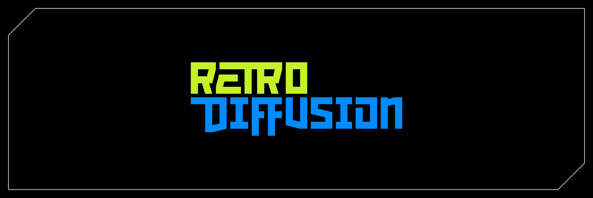
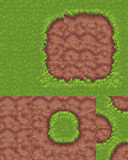
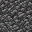

<p align="center">
  
</p>

Main generation endpoint:
- `POST https://api.retrodiffusion.ai/v1/inferences`
- Header: `X-RD-Token: YOUR_API_KEY`

## Quick start: generate an image

1. Generate an API key from your [RetroDiffusion account](https://www.retrodiffusion.ai/app/devtools).
2. Make sure you have available balance in your account.
   Take in mind that each model supports different styles.
3. Send a request. This example generates one image using `RD_PRO` using the default style:

```python
import requests

url = "https://api.retrodiffusion.ai/v1/inferences"
method = "POST"

headers = {
    "X-RD-Token": "YOUR_API_KEY",
}

payload = {
    "width": 256,
    "height": 256,
    "prompt": "A really cool corgi",
    "prompt_style": "rd_pro__default"
    "num_images": 1
}

response = requests.request(method, url, headers=headers, json=payload)
print(response.text)
```

Response format example:

```json
{
  "created_at": 1733425519,
  "balance_cost": 0.25,
  "base64_images": ["..."],
  "model": "rd_pro",
  "remaining_balance": 100.75
}
```

## Check cost before generating

Use `check_cost: true` to estimate credit cost without generating images:

```python
import requests

url = "https://api.retrodiffusion.ai/v1/inferences"
method = "POST"

headers = {
    "X-RD-Token": "YOUR_API_KEY",
}

payload = {
    "width": 256,
    "height": 256,
    "prompt": "A really cool corgi",
    "prompt_style": "rd_pro__default"
    "num_images": 1,
    "check_cost": true
}

response = requests.request(method, url, headers=headers, json=payload)
print(response.text)
```

Cost-only response example:

```json
{
	"created_at": 1770893613,
	"balance_cost": 0.25,
	"output_images": [],
	"base64_images": [],
	"output_urls": [],
	"model": "check_cost",
	"remaining_balance": 100.75
}
```

## Model and style selection

### Using RD_PRO models

- `RD_PRO` is our newest and most advanced model.
- It supports several styles passed in the `prompt_style` parameter.
- Default size range is `96x96 <-> 256x256` unless otherwise specified.

Available `RD_PRO` styles:
- `rd_pro__default` - `Clean modern pixel art style model that allows multiple reference images and extremely detailed prompting.`
- `rd_pro__painterly` - `Almost brush-like style with minimal outlines or anti-aliasing. Clean vibrant color palettes and beautiful details`
- `rd_pro__fantasy` - `Bright colors, soft transitions, detailed textures, light dithering, and outlines.`
- `rd_pro__ui_panel` - `Consistent arrangements of UI elements, split into buttons, sliders, panels, and knobs.`
- `rd_pro__horror` - `Dark, gritty style with chaotic details and harsh shapes and shading.`
- `rd_pro__scifi` - `High contrast with glowing details, clean outlines, and beautiful lighting.`
- `rd_pro__simple` - `Simple pixel art with minimal shading or texturing, but strong outlines and shapes.`
- `rd_pro__isometric` - `Pixel art rotated at a 45 degree angle. Clean lines and shapes.`
- `rd_pro__topdown` - `Pixel art viewed from a 2/3 downwards angle, with simple shapes and shading.`
- `rd_pro__platformer` - `Side-scroller style platformer perspective, with modern styling and outlines.`
- `rd_pro__dungeon_map` - `Dungeon-crawler style game levels with connected rooms filled with objects and enemies.`
- `rd_pro__edit` - `Upload an image and describe the changes you want. You can use up to 9 references.`
- `rd_pro__pixelate` - `Convert input images into pixel art.`
- `rd_pro__spritesheet` - `Collections of assets on a simple background with the same style.`
- `rd_pro__typography` - `Generate logos, buttons, or any other element using text as the central focus.`
- `rd_pro__hexagonal_tiles` - `Small collection of hexagonal tiles for game maps.`
- `rd_pro__fps_weapon` - `First person perspective weapons, items, and objects.`
- `rd_pro__inventory_items` - `Creates a spritesheet of grid aligned inventory items (like for Diablo or Path of Exile)`

`RD_PRO` reference images:
- You can pass up to 9 base64-encoded images using `reference_images`.

```json
{
	"width": 256,
	"height": 256,
	"prompt": "corgi",
	"num_images": 1,
	"prompt_style": "rd_pro__default",
	"check_cost": false,
	"reference_images": [
		"iVBORw0KGgoAAA..."
	]
}
```

### Using RD_FAST models

- `RD_FAST` only supports one style at a time via `prompt_style`.
- Default size range is `64x64 <-> 384x384` unless otherwise specified.

Example:

```python
payload = {
    "width": 256,
    "height": 256,
    "prompt": "A really cool corgi wearing sunglasses and a party hat",
    "num_images": 1,
    "prompt_style": "rd_fast__simple"
}
```

Available `RD_FAST` styles:
- `rd_fast__default` - `Simple clean pixel art, with Anime illustration influences`
- `rd_fast__retro` - `A classic arcade game aesthetic inspired by early PC games`
- `rd_fast__simple` - `Simple shading with minimalist shapes and designs`
- `rd_fast__detailed` - `Pixel art with lots of shading and details`
- `rd_fast__anime` - `Simple clean pixel art, with Anime illustration influences`
- `rd_fast__game_asset` - `Distinct assets set on a simple background`
- `rd_fast__portrait` - `Character portrait focused images with high detail`
- `rd_fast__texture` - `Flat game textures like stones, bricks, or wood`
- `rd_fast__ui` - `User interface boxes and buttons`
- `rd_fast__item_sheet` - `Sheets of objects placed on a simple background`
- `rd_fast__character_turnaround` - `Character sprites viewed from different angles`
- `rd_fast__1_bit` - `Two color black and white only images`
- `rd_fast__low_res` - `(16x16 <-> 128x128) General low resolution pixel art images`
- `rd_fast__mc_item` - `(16x16 <-> 128x128) Minecraft-styled items with automatic transparency`
- `rd_fast__mc_texture` - `(16x16 <-> 128x128) Minecraft-styled flat textures, like grass, stones, or wood`
- `rd_fast__no_style` - `Pixel art with no style influence applied`

### Using RD_PLUS models

- `RD_PLUS` supports several styles passed in the `prompt_style` parameter.

Available `RD_PLUS` styles:
- `rd_plus__default` - `Clean pixel art style with bold colors and outlines`
- `rd_plus__retro` - `Classic pixel art style inspired by PC98 games`
- `rd_plus__watercolor` - `Pixel art mixed with a watercolor painting aesthetic`
- `rd_plus__textured` - `Semi-realistic pixel art style with lots of shading and texture`
- `rd_plus__cartoon` - `Simple shapes and shading, with bold outlines`
- `rd_plus__ui_element` - `User interface boxes and buttons`
- `rd_plus__item_sheet` - `Sheets of objects placed on a simple background`
- `rd_plus__character_turnaround` - `Character sprites viewed from different angles`
- `rd_plus__environment` - `One-point perspective scenes with outlines and strong shapes`
- `rd_plus__topdown_map` - `Video game map style pixel art with a 3/4 top down perspective`
- `rd_plus__topdown_asset` - `3/4 top down perspective game assets on a simple background`
- `rd_plus__isometric` - `45 degree isometric perspective, with consistent outlines`
- `rd_plus__isometric_asset` - `45 degree isometric objects or assets, on a neutral background`
- `rd_plus__classic` - `(32x32 <-> 192x192) Strongly outlined medium-resolution pixel art with a focus on simple shading and clear design`
- `rd_plus__low_res` - `(16x16 <-> 128x128) High quality, low resolution pixel art assets and backgrounds`
- `rd_plus__mc_item` - `(16x16 <-> 128x128) High quality Minecraft-styled items and game assets`
- `rd_plus__mc_texture` - `(16x16 <-> 128x128) Detailed Minecraft-style flat block textures, with enhanced prompt following`
- `rd_plus__topdown_item` - `(16x16 <-> 128x128) Top-down view of items and objects, with a simple background`
- `rd_plus__skill_icon` - `(16x16 <-> 128x128) Icons for skills, abilities, or spells`

### User-created styles

- You can pass your own style IDs (or imported user styles) in `prompt_style`.
- Find style IDs and language-specific sample code via the **Show API Code** button at the top-left corner of the web app canvas.

```python
import requests

url = "https://api.retrodiffusion.ai/v1/inferences"
method = "POST"

headers = {
    "X-RD-Token": "YOUR_API_KEY",
}

payload = {
    "prompt": "life and mana flasks",
    "width": 256,
    "height": 256,
    "num_images": 4,
    "seed": 1105683575,
    "prompt_style": "user__flasks_586",
    "tile_x": False,
    "tile_y": False,
    "remove_bg": True
}

response = requests.request(method, url, headers=headers, json=payload)
print(response.text)
```

### Create user styles via API (RD Pro template)

Endpoint:
- `POST https://api.retrodiffusion.ai/v1/styles`
- Header: `X-RD-Token: YOUR_API_KEY`

This endpoint currently supports only the **RD Pro** user template.
All non-template fields are rejected.

Allowed request fields:
- `name` (required)
- `description`
- `style_icon`
- `reference_images` (max 1)
- `reference_caption`
- `apply_prompt_fixer`
- `llm_instructions`
- `expanded_llm_instructions`
- `user_prompt_template`
- `force_palette`
- `force_bg_removal`
- `min_width` and `min_height` (optional forced dimensions, both required together, range `96..256`)

Valid `style_icon` values:

```text
sparkles, fire, bolt, star, heart, cube, globe, sun, moon, cloud, beaker, command, cpu, brush, photo, film, music, rocket, puzzle, cube-transparent, swatch, eyedropper, grid, stack, viewfinder, adjustments, crystal, magic-swirl, swordman, dragon, castle, forest, mountain, water-drop, flame, snowflake, lightning, stone, mineral, gem, diamonds, wizard-staff, portal, sunrise, moon-bats, night-sky, galaxy, planet, abstract-1, abstract-2, gamepad, dice, skull, crown, wizard-hat, ghost, robot, shuttle, fa-star, fa-heart, leaf, tree, fa-mountain, fa-water, fa-sun, fa-moon, tb-sparkles, wand, palette, tb-brush, tb-photo, movie, user, user-gear, user-friends, users-viewfinder, walking, person, child-reaching, grin-beam, hand-back-fist
```

Notes:
- Use the returned `prompt_style` as the value for `prompt_style` in `/v1/inferences`.

Example:

```python
import requests

url = "https://api.retrodiffusion.ai/v1/styles"
method = "POST"

headers = {
    "X-RD-Token": "YOUR_API_KEY",
}

payload = {
    "name": "My RD Pro Style",
    "description": "A polished pixel art look for item art",
    "style_icon": "sparkles",
    "reference_images": ["iVBORw0KGgoAAA..."],
    "apply_prompt_fixer": True,
    "llm_instructions": "Push clean outlines and rich material contrast.",
    "user_prompt_template": "Pixel art styled {prompt}, with 1px outlines and detailed textures.",
    "force_palette": False,
    "force_bg_removal": False,
    "min_width": 192,
    "min_height": 192
}

response = requests.request(method, url, headers=headers, json=payload)
print(response.text)
```

Response excerpt:

```json
{
  "id": "user_style_3f05d16f5f2e4cbf9d99f2f9df25b2cb",
  "prompt_style": "user__my_pro_style_1a2b3c4d",
  "name": "My Pro Style",
  "description": "A polished pixel art look for item art",
  "type": "user",
  "created_at": 1771557653,
  "updated_at": 1771557653
}
```

Use returned `prompt_style` for inference:

```python
payload = {
    "prompt": "life and mana flasks",
    "width": 192,
    "height": 192,
    "num_images": 1,
    "prompt_style": "user__my_pro_style_1a2b3c4d"
}
```

### Update user style (RD Pro template)

Endpoint:
- `PATCH https://api.retrodiffusion.ai/v1/styles/{style_id}`
- Header: `X-RD-Token: YOUR_API_KEY`

Notes:
- Request body accepts the same RD Pro editable fields as create, but all optional

Example:

```python
import requests

style_id = "user__my_pro_style_1a2b3c4d"  # or internal id
url = f"https://api.retrodiffusion.ai/v1/styles/{style_id}"

headers = {"X-RD-Token": "YOUR_API_KEY"}
payload = {
    "description": "Updated description",
    "llm_instructions": "Use clean outlines and higher local contrast.",
    "min_width": 256,
    "min_height": 256
}

response = requests.patch(url, headers=headers, json=payload)
print(response.text)
```

Response excerpt:

```json
{
  "id": "user_style_3f05d16f5f2e4cbf9d99f2f9df25b2cb",
  "prompt_style": "user__my_pro_style_1a2b3c4d",
  "name": "My Pro Style",
  "description": "Updated description",
  "type": "user",
  "created_at": 1771557653,
  "updated_at": 1771559999
}
```

### Delete user style

Endpoint:
- `DELETE https://api.retrodiffusion.ai/v1/styles/{style_id}`
- Header: `X-RD-Token: YOUR_API_KEY`

Example:

```python
import requests

style_id = "user__my_pro_style_1a2b3c4d"
url = f"https://api.retrodiffusion.ai/v1/styles/{style_id}"
headers = {"X-RD-Token": "YOUR_API_KEY"}

response = requests.delete(url, headers=headers)
print(response.text)
```

Response:

```json
{
  "id": "user_style_3f05d16f5f2e4cbf9d99f2f9df25b2cb",
  "prompt_style": "user__my_pro_style_1a2b3c4d",
  "deleted": true
}
```

## Requesting an animation

Animation styles:
- `animation__any_animation` - `(64x64 only) Describe an animation and bring pixel art to life`
- `animation__8_dir_rotation` - `(80x80 only) Create 8 direction rotations of anything`
- `animation__four_angle_walking` - `(48x48 only) Consistent 4 direction, 4 frame long walking animations of humanoid characters`
- `animation__walking_and_idle` - `(48x48 only) Consistent 4 direction walking and idle animations of humanoid characters`
- `animation__small_sprites` - `(32x32 only) Consistent 4 direction walking, arm movement, looking, surprised, and laying down animations`
- `animation__vfx` - `(24x24 <-> 96x96, 1:1 aspect ratio) Eye-catching animations for fire, explosions, lightning, or other simple effects`
- `animation__any_animation` - `(64x64 only) General purpose custom animation sheets with optional first frame input`

Important notes:
- `animation__four_angle_walking` and `animation__walking_and_idle` currently only support `48x48`. Bigger or smaller resolutions will be ignored and default to `48x48`.
- `animation__small_sprites` only supports `32x32`.
- `animation__vfx` supports sizes between `24x24` and `96x96`, square aspect ratios only.
- Animations only support generating one image at a time.
- Outputs are transparent GIF images encoded in base64.

Example animation payload:

> This payload will generate a 48x48 transparent GIF. If you want a spritesheet, see the next example.

```python
{
	"prompt": "corgi wearing a party hat",
	"width": 48,
	"height": 48,
	"num_images": 1,
	"seed": 123,
	"prompt_style": "animation__four_angle_walking"
}
```

Spritesheet output:

> Add `return_spritesheet: true` to output a transparent PNG spritesheet.

```python
{
	"prompt": "corgi wearing a party hat",
	"width": 48,
	"height": 48,
	"num_images": 1,
	"seed": 123,
	"prompt_style": "animation__four_angle_walking",
	"return_spritesheet": true
}
```

Walking and idle format reference:


Small sprites format reference:


Animation reference image input:
- Use `input_image` to provide a base64 reference.
- `input_image` should be base64-encoded RGB with no transparency.
- Include a brief description of the reference image in your prompt.
- Do not include `data:image/png;base64,` in the base64 string.

```python
{
	"prompt": "robot",
	"width": 48,
	"height": 48,
	"num_images": 1,
	"seed": 1234,
	"prompt_style": "animation__four_angle_walking",
	"return_spritesheet": true,
	"input_image": "iVBORw0KGgoAAAANSUhEUgAAAUA... ... ..."
}
```

Tips for `animation__any_animation`:
- Because it is open-ended, include a detailed prompt about both content and action sequence.
- It can also be used for broader spritesheet tasks (character portrait variations, item sheets, and other creative uses).
- Use a `64x64` input image for near-perfect subject adherence.

## Working with tilesets



All tileset styles:
- `rd_tile__tileset` - `(16x16 <-> 32x32) Create full tilesets from a simple prompt describing the textures or environment, using a simple set of "wang" style combinations`
- `rd_tile__tileset_advanced` - `(16x16 <-> 32x32) Full tilesets from two prompts and/or textures, using a simple set of "wang" style combinations`
- `rd_tile__single_tile` - `(16x16 <-> 64x64) Detailed single tile texture for creating full tilesets or surfaces`
- `rd_tile__tile_variation` - `(16x16 <-> 128x128) Texture variations of the provided tile image`
- `rd_tile__tile_object` - `(16x16 <-> 96x96) Small assets for placing on sections of tiles`
- `rd_tile__scene_object` - `(64x64 <-> 384x384) Large assets for placing on tileset maps`

### Full tilesets

Use:
- `rd_tile__tileset`
- `rd_tile__tileset_advanced`

Details:
- `rd_tile__tileset` supports an inspiration image via `input_image`.
- `rd_tile__tileset_advanced` supports inside/outside textures:
  - Inside texture image: `input_image`
  - Outside texture image: `extra_input_image`
  - Inside texture text: `prompt`
  - Outside texture text: `extra_prompt`
- `width` and `height` specify tile size, from `16` to `32`.

Advanced tileset example:

```python
{
  "width": 32,
  "height": 32,
  "prompt": "grey stones with gravel and dirt",
  "extra_prompt": "lush green grass",
  "num_images": 1,
  "prompt_style": "rd_tile__tileset_advanced",
  "seed": 123,
  "input_image": "iVBORw0KGgoAAAANSUhEUgAAAUA... ... ...",
  "extra_input_image": "iVBORw0KGgoAAAANSUhEUgAAAUA... ... ..."
}
```

Tileset format:


### Single tiles



- Use `rd_tile__single_tile`.
- `width` and `height` range from `16` to `64`.

Example:

```python
{
  "width": 32,
  "height": 32,
  "prompt": "volcanic rock with cracks",
  "num_images": 1,
  "prompt_style": "rd_tile__single_tile"
}
```

### Tile variation

- Use `rd_tile__tile_variation`.
- `input_image` is required and must be a base64 tile image.
- Use `prompt` to describe desired variation changes.

Example:

```python
{
  "width": 32,
  "height": 32,
  "prompt": "add moss and cracks",
  "num_images": 1,
  "prompt_style": "rd_tile__tile_variation",
  "input_image": "iVBORw0KGgoAAAANSUhEUgAAAUA... ... ..."
}
```

## Using img2img

- Send a base64 image in `input_image` and adjust `strength`.
- `strength` must be between `0` and `1` and controls how much the image is modified.
- Do not include `data:image/png;base64,` in base64 input.
- Input image should be RGB with no transparency.

```python
with Image.open(input_image_path) as img:
    rgb_img = img.convert('RGB')
    buffer = BytesIO()
    rgb_img.save(buffer, format='PNG')
    base64_input_image = base64.b64encode(buffer.getvalue()).decode('utf-8')

payload = {
    "prompt": "A really cool corgi wearing sunglasses and a party hat",
    "width": 256,
    "height": 256,
    "input_image": base64_input_image,
    "strength": 0.8
}
```

## Using a palette as reference

- Use `input_palette` to guide output colors.
- Send `input_palette` as a base64 image.
- `input_palette` should have no transparency.
- Keep palette images small (below `1MB`, recommended `200k` characters or less).
- Do not include `data:image/png;base64,` in base64 input.

```python
{
  "prompt": "a raven with a glowing green eye",
  "width": 256,
  "height": 256,
  "num_images": 1,
  "seed": 1234,
  "input_palette": "iVBORw0KGgoAAAANSUhEUgAAAUA... ... ..."
}
```

Optional: set `return_pre_palette: true` to also receive the original image before palette application.

```python
{
  "prompt": "a raven with a glowing green eye",
  "width": 256,
  "height": 256,
  "num_images": 1,
  "seed": 1234,
  "input_palette": "iVBORw0KGgoAAAANSUhEUgAAAUA... ... ...",
  "return_pre_palette": true
}
```

When `return_pre_palette` is enabled, the response includes an extra string in `base64_images` containing the original pre-palette image.

## Using background removal for transparent images

- Set `remove_bg` as a boolean.

```python
payload = {
    "prompt": "a raven with a glowing green eye",
    "width": 128,
    "height": 128,
    "remove_bg": True
}
```

Optional: set `return_non_bg_removed: true` to also receive the original image before background removal.

```python
payload = {
    "prompt": "a raven with a glowing green eye",
    "width": 128,
    "height": 128,
    "remove_bg": True,
    "return_non_bg_removed": True
}
```

When `return_non_bg_removed` is enabled, the response includes an extra string in `base64_images` containing the non-background-removed image.

## Using seamless tiling

- Set both `tile_x` and `tile_y` as booleans.

```python
payload = {
    "prompt": "Stone bricks",
    "width": 128,
    "height": 128,
    "tile_x": true,
    "tile_y": true
}
```

## Ignoring prompt expansion

- Use `bypass_prompt_expansion: true` to disable prompt expansion.

```python
payload = {
    "prompt": "a raven with a glowing green eye",
    "width": 128,
    "height": 128,
    "bypass_prompt_expansion": True
}
```

## Including downloadable data

- Use `include_downloadable_data: true` to include generated downloadable artifacts in the response.
- This is useful for styles that return structured assets (for example `rd_pro__inventory_items`).

Example payload:

```json
{
	"width": 256,
	"height": 256,
	"prompt": "item set for a paladin",
	"num_images": 1,
	"prompt_style": "rd_pro__inventory_items",
	"check_cost": false,
	"include_downloadable_data": true
}
```

Example response excerpt:

```json
{
	"downloadable_data": {
		"downloadable_json": {
			"data": {
				"meta": {
					"count": 10,
					"mask_h": 128,
					"mask_w": 128,
					"image_h": 256,
					"image_w": 256
				},
				"sprites": [
					{
						"h": 152,
						"w": 48,
						"x": 16,
						"y": 16,
						"id": 0,
						"name": "Holy sword, lion shield, enchanted armor, healing potion, blessed amulet, warhorse figurine, prayer book, golden chalice",
						"mask_h": 76,
						"mask_w": 24,
						"mask_x": 8,
						"mask_y": 8
					},
					...
					...
					...
				]
			},
			"type": "item_atlas",
			"filename": "item_atlas.json",
			"description": "Sprite atlas with item positions and names"
		}
	}
}
```

## Image editing endpoint


- Endpoint: `POST https://api.retrodiffusion.ai/v1/edit`
- Request body:

```json
{
    "prompt": "add a hat",
    "inputImageBase64": "iVBORw0KGgoAAAANSUhEUgAAAUA...",
}
```

Notes:
- Supported sizes are between `16x16` and `256x256`.
- You can send any image within the size limits to be edited.
- Progressive editing is supported by using the output of one task as input for a new task.
- Cost is **0.06 USD** per image edit.

Response format:

```json
{
  "outputImageBase64": "iVBORw0KGgoAAAANSUhEUgAAAUA...",
  "remaining_credits": 999
}
```

## FAQ

### How much does it cost?

Cost is based on model and resolution. You can check request cost in the [web app](https://www.retrodiffusion.ai/).
These formulas can be used as a guide for automated cost calculations.

Standard image model pricing:
- All costs are rounded to three decimal places.
- `rd_fast` styles:
  - Balance cost = `max(0.015, ((width * height) + 100000) / 6000000) * number of images`
- `rd_plus` styles:
  - Balance cost = `max(0.025, ((width * height) + 50000) / 2000000) * number of images`

Low-resolution model pricing:
- `rd_plus__mc_texture`, `rd_plus__mc_item`, `rd_plus__low_res`, `rd_plus__classic`, `rd_plus__topdown_item`, `rd_plus__skill_icon`, `rd_tile__tile_variation`, `rd_tile__single_tile`, `rd_tile__tile_object`
  - Balance cost = `max(0.02, ((width * height) + 13700) / 600000) * number of images`

`rd_pro` styles:
- Balance cost = `0.22 * number of images`

Editing class styles:
- `rd_pro__pixelate`
  - Balance cost = `0.25 * number of images`

Unique model pricing:
- `animation__four_angle_walking`, `animation__walking_and_idle`, `animation__small_sprites`, `animation__vfx`
  - Balance cost = `0.07`
- `rd_tile__tileset`, `rd_tile__tileset_advanced`
  - Balance cost = `0.10`
- `animation__any_animation`, `animation__8_dir_rotation`
  - Balance cost = `0.25`

### How can I check my remaining credits?

Send a `GET` request to:
- `https://api.retrodiffusion.ai/v1/inferences/credits`

With header:
- `X-RD-Token: YOUR_API_KEY`

Response format:

```json
{
  "balance": 100.75
}
```

### Can I buy credits from the API?

No. To keep balance topped up automatically, use **auto refills** in [Payment Methods](https://www.retrodiffusion.ai/app/payment-methods).

### How to get images at native resolution?

Use `upscale_output_factor`:
- Set to `1` for native resolution.
- Set to `null` for regular size.

## MCP (Model Context Protocol)

You can connect to RetroDiffusion through MCP to call tools like:
- `get_balance`
- `list_available_styles`
- `create_inference`

### Codex setup (`~/.codex/config.toml`)

1. Export your API key in the shell where Codex runs:

```bash
export RD_API_KEY="YOUR_API_KEY"
```

2. Add this MCP server block:

```toml
[mcp_servers.retrodiffusion]
url = "https://mcp.retrodiffusion.ai/mcp"
bearer_token_env_var = "RD_API_KEY"
startup_timeout_sec = 20
tool_timeout_sec = 120
enabled = true
```

3. Restart Codex so it reloads MCP config and environment variables.

### Cursor setup (`~/.cursor/mcp.json`)

```json
{
  "mcpServers": {
    "retrodiffusion": {
      "url": "https://mcp.retrodiffusion.ai/mcp",
      "headers": {
        "Authorization": "Bearer ${env:RD_API_KEY}"
      }
    }
  }
}
```

### Antigravity setup (`mcp_config.json`)

```json
{
  "mcpServers": {
    "retrodiffusion": {
      "serverUrl": "https://mcp.retrodiffusion.ai/mcp",
      "headers": {
        "Authorization": "Bearer YOUR_API_KEY"
      }
    }
  }
}
```

### VS Code setup (`.vscode/mcp.json`)

```json
{
  "inputs": [
    {
      "type": "promptString",
      "id": "rd_api_key",
      "description": "RetroDiffusion API key",
      "password": true
    }
  ],
  "servers": {
    "retrodiffusion": {
      "type": "http",
      "url": "https://mcp.retrodiffusion.ai/mcp",
      "headers": {
        "Authorization": "Bearer ${input:rd_api_key}"
      }
    }
  }
}
```

Docs:
- Cursor: `https://cursor.com/docs/context/mcp`
- Antigravity: `https://antigravity.google/docs/mcp`
- VS Code: `https://code.visualstudio.com/docs/copilot/customization/mcp-servers`
