<p align="center">
  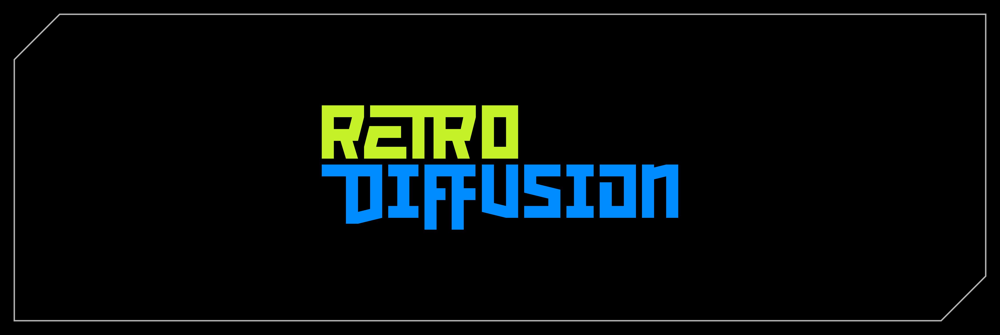
</p>

# Retro Diffusion API

Generate pixel art — images, animations, and tilesets — over a simple HTTP API.

<table>
  <tr>
    <td>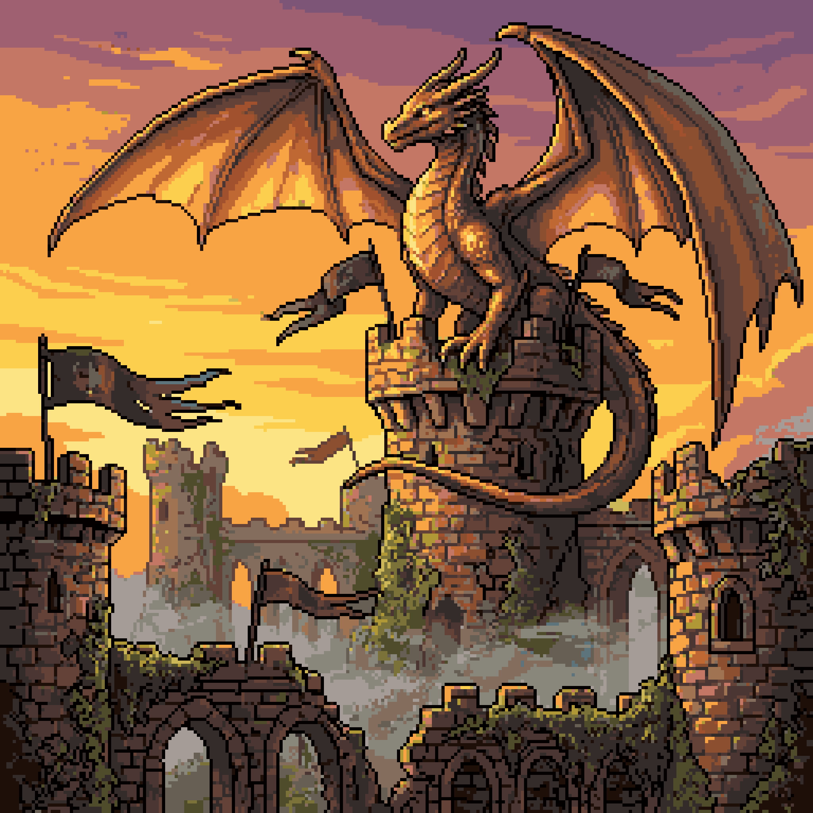</td>
    <td>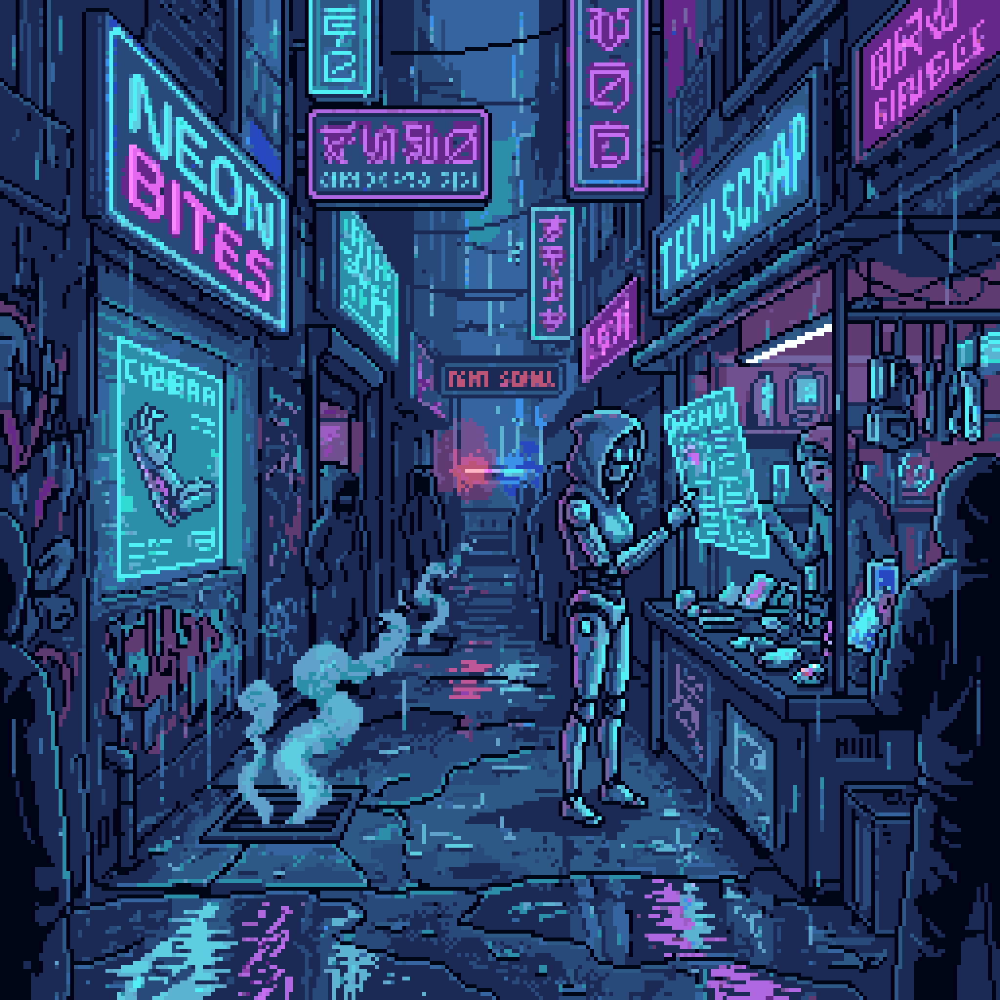</td>
    <td>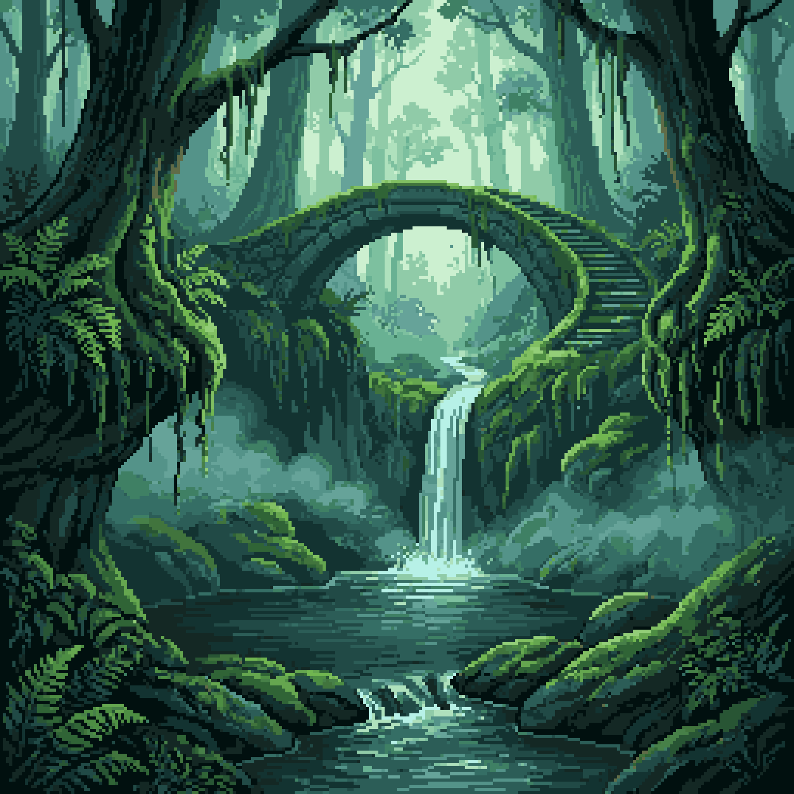</td>
  </tr>
  <tr>
    <td>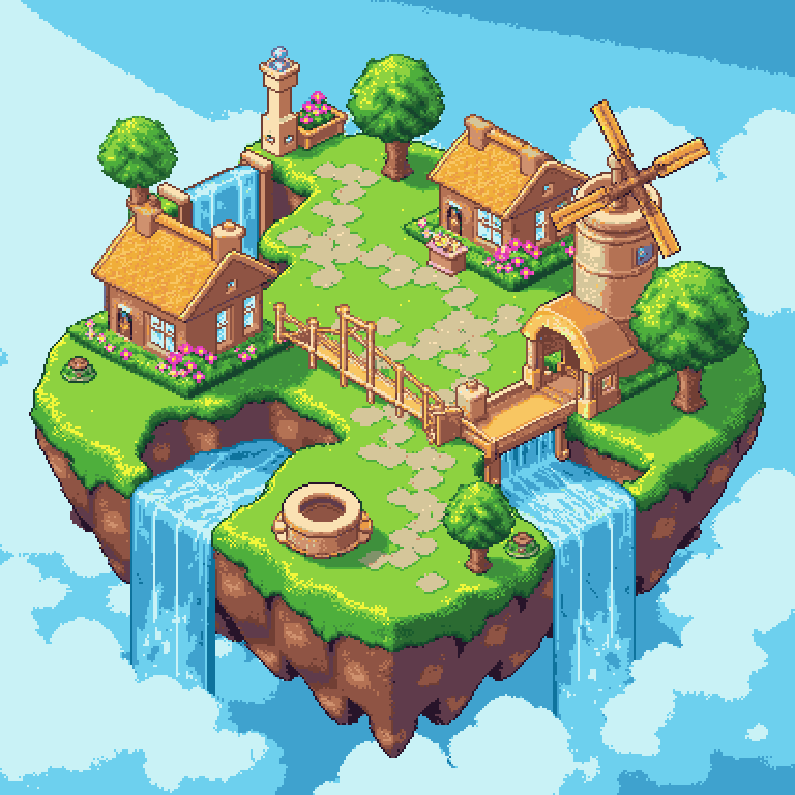</td>
    <td>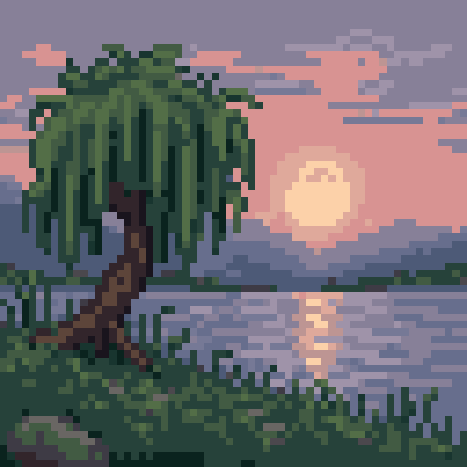</td>
    <td>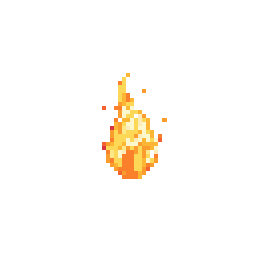</td>
  </tr>
</table>

**📖 Full reference:** **https://www.retrodiffusion.ai/app/guide/api** — every endpoint and
field, an interactive style explorer, live pricing, and MCP setup. This repo holds runnable
examples and a machine-readable summary; the hosted page is the source of truth.

- **Base URL:** `https://api.retrodiffusion.ai/v1`
- **Auth:** header `X-RD-Token: YOUR_API_KEY` on every request (keys start with `rdpk-`)
- **Create a key:** https://www.retrodiffusion.ai/app/devtools (max 5 per account)
- Usage spends your account's prepaid USD balance; charges are refunded automatically if a generation fails.

## Runnable examples

Everything in [`example-scripts/`](example-scripts) is a small, focused script. Set your key once
and run any of them:

```bash
export RD_API_KEY="rdpk-..."          # macOS / Linux  (setx on Windows)
pip install -r example-scripts/requirements.txt
python example-scripts/01_generate_image.py
```

| Script | What it shows |
| --- | --- |
| [`01_generate_image.py`](example-scripts/01_generate_image.py) | The simplest text-to-image request |
| [`02_check_cost.py`](example-scripts/02_check_cost.py) | Free price check before generating |
| [`03_img2img.py`](example-scripts/03_img2img.py) | Transform an existing image with `input_image` + `strength` |
| [`04_reference_images.py`](example-scripts/04_reference_images.py) | Keep a character consistent with RD Pro reference images |
| [`05_animation.py`](example-scripts/05_animation.py) | Animate a start frame (advanced animations → GIF) |
| [`06_tileset.py`](example-scripts/06_tileset.py) | Generate a wang-style tileset |
| [`07_async_batch.py`](example-scripts/07_async_batch.py) | Fan out many generations with async jobs |
| [`08_list_styles.py`](example-scripts/08_list_styles.py) | Discover every style your account can use |
| [`09_edit_tools.py`](example-scripts/09_edit_tools.py) | Discover, estimate, and run any canvas edit tool |
| [`10_pixel_fixer.py`](example-scripts/10_pixel_fixer.py) | Restore an enlarged or softened image to its native pixel grid |
| [`generate_image.mjs`](example-scripts/generate_image.mjs) | The basic request from Node.js (no dependencies) |

**Building an agent or LLM integration?** Paste [`llms.txt`](llms.txt) into your agent's context —
it's a complete, verified plain-text summary of this API. Agents with MCP support can instead
connect to the hosted MCP server at `https://mcp.retrodiffusion.ai/mcp` (header
`Authorization: Bearer YOUR_API_KEY`) — 18 typed tools covering generation, Pixel Fixer, free cost estimates,
async jobs for animations and batches, the canvas edit tools, custom styles, and service health.
Per-client setup guides live in the
[retro-diffusion-mcp repo](https://github.com/Retro-Diffusion/retro-diffusion-mcp).

## Quick start

Create a key, make sure you have balance, then send a request:

```python
import base64
import requests

url = "https://api.retrodiffusion.ai/v1/inferences"
headers = {"X-RD-Token": "YOUR_API_KEY"}
payload = {
    "prompt": "A really cool corgi wearing sunglasses",  # describe the SUBJECT only
    "prompt_style": "rd_plus__default",                  # the style handles the pixel-art look
    "width": 256,
    "height": 256,
    "num_images": 1,
    "seed": 42,                                          # optional; omit for random
}

response = requests.post(url, headers=headers, json=payload)
response.raise_for_status()
data = response.json()

for i, image in enumerate(data["base64_images"]):
    with open(f"output_{i}.png", "wb") as f:
        f.write(base64.b64decode(image))

print(f"Cost: ${data['balance_cost']}   Remaining: ${data['remaining_balance']}")
```

Response (null fields are omitted):

```json
{
  "created_at": "2026-07-08T15:04:05",
  "balance_cost": 0.058,
  "base64_images": ["iVBORw0KGgo..."],
  "model": "rd_plus",
  "remaining_balance": 100.75
}
```

`base64_images` entries are raw base64 — PNG normally, GIF for animation styles. Decode and
write them to disk. Set `"upload_outputs": true` to receive hosted URLs in `output_urls` instead.

## Models

Pass a style id in `prompt_style`; the style also determines the model. Call
`GET /v1/styles/selector` (see [`08_list_styles.py`](example-scripts/08_list_styles.py)) for the
live catalog with each style's exact size limits, batch cap, and input requirements.

The same prompt and seed across all four models:

<table>
  <tr>
    <td align="center">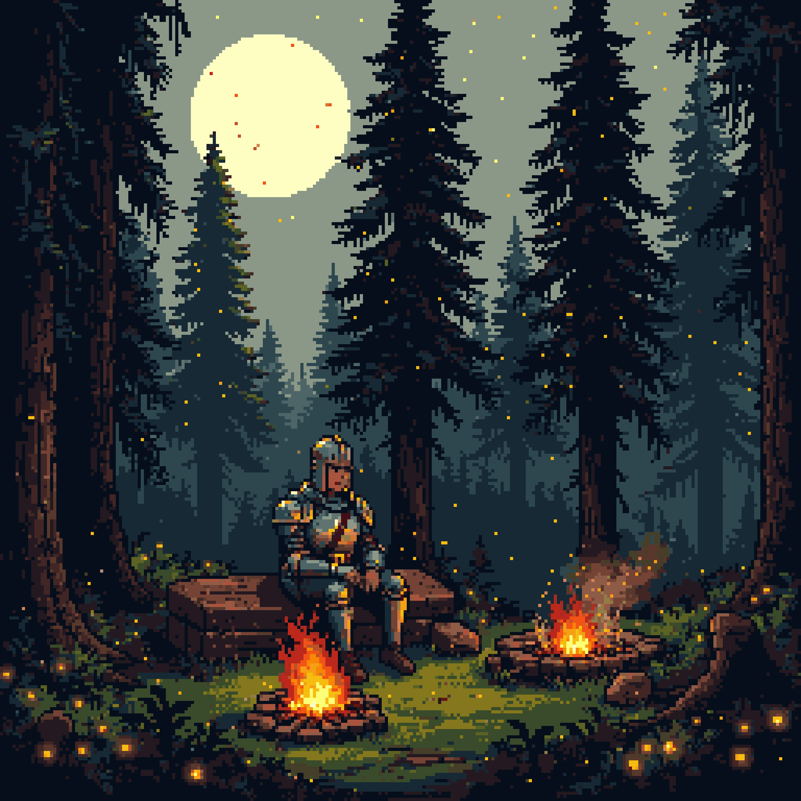<br><sub><b>RD Fast</b> · ~$0.03</sub></td>
    <td align="center">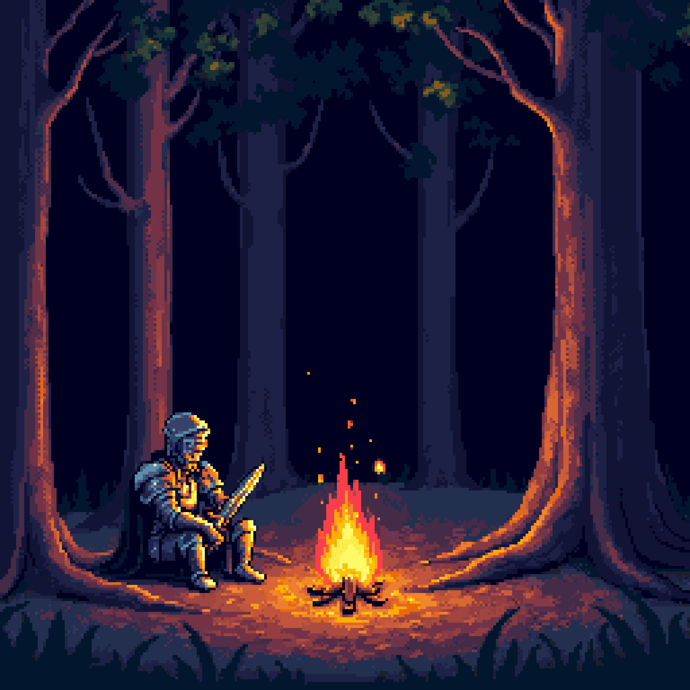<br><sub><b>RD Plus</b> · ~$0.06</sub></td>
    <td align="center">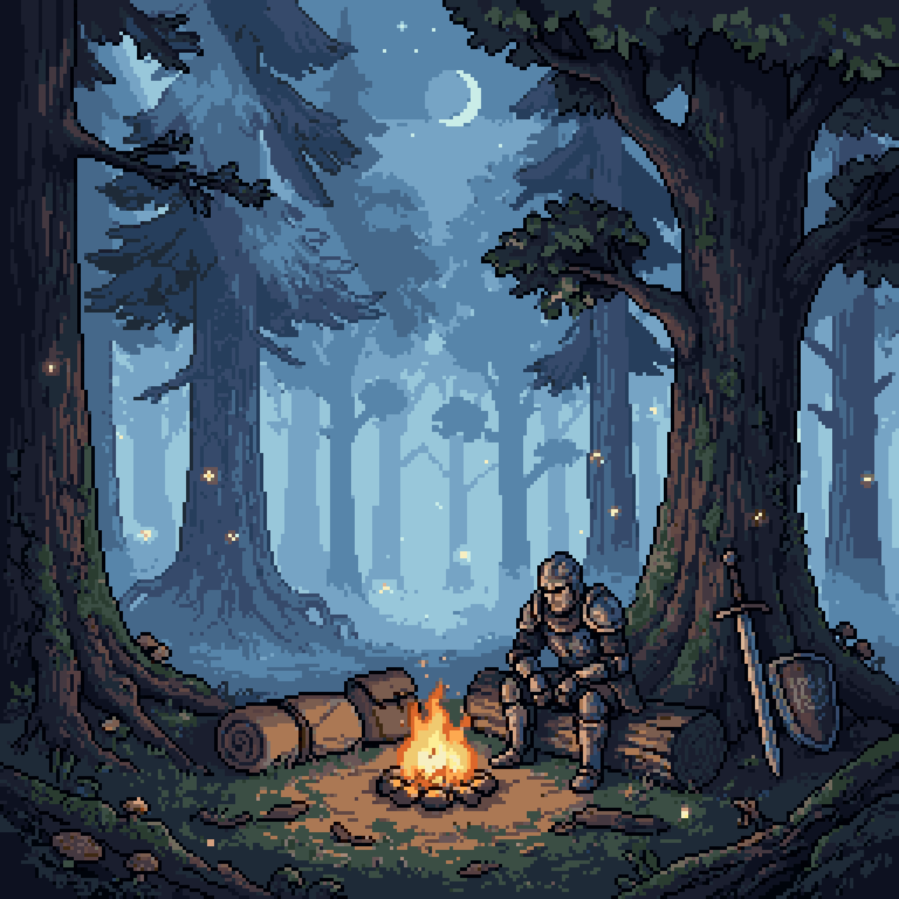<br><sub><b>RD Pro</b> · $0.18</sub></td>
    <td align="center">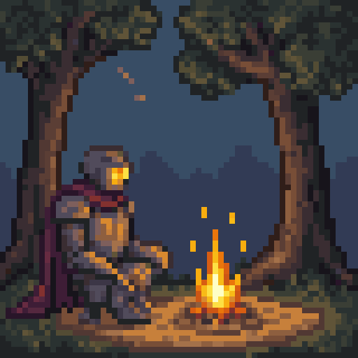<br><sub><b>RD Mini</b> · ~$0.03</sub></td>
  </tr>
</table>

**RD Pro — highest quality.** The professional-grade model: the cleanest pixel work, the most
detailed prompt following, and support for up to **9 reference images** to keep a character or
art style consistent. Best for hero assets and matching an existing look. `$0.18`/image, 64–256px,
batch ≤ 4. Styles: `rd_pro__default`, `rd_pro__painterly`, `rd_pro__fantasy`, `rd_pro__horror`,
`rd_pro__scifi`, `rd_pro__simple`, `rd_pro__isometric`, `rd_pro__topdown`, `rd_pro__platformer`,
`rd_pro__dungeon_map`, `rd_pro__spritesheet`, `rd_pro__fps_weapon`, `rd_pro__typography`.
256×256-only: `rd_pro__hexagonal_tiles`, `rd_pro__ui_panel`, `rd_pro__inventory_items`.
Require an input image: `rd_pro__edit`, `rd_pro__pixelate`.

**RD Plus — quality all-rounder** with the largest style library. 64–384px (low-res variants
smaller), batch ≤ 16: `rd_plus__default`, `rd_plus__retro`, `rd_plus__watercolor`,
`rd_plus__textured`, `rd_plus__cartoon`, `rd_plus__ui_element`, `rd_plus__item_sheet`,
`rd_plus__character_turnaround`, `rd_plus__environment`, `rd_plus__isometric`,
`rd_plus__isometric_asset`, `rd_plus__topdown_map`, `rd_plus__topdown_asset`, `rd_plus__classic`,
`rd_plus__skill_icon`, `rd_plus__low_res`, `rd_plus__mc_item`, `rd_plus__mc_texture`,
`rd_plus__topdown_item`.

**RD Fast — fastest and cheapest**, great for drafting. 64–384px (low-res smaller), batch ≤ 16:
`rd_fast__default`, `rd_fast__simple`, `rd_fast__detailed`, `rd_fast__retro`,
`rd_fast__game_asset`, `rd_fast__portrait`, `rd_fast__texture`, `rd_fast__ui`,
`rd_fast__item_sheet`, `rd_fast__character_turnaround`, `rd_fast__no_style`, `rd_fast__1_bit`,
`rd_fast__low_res`, `rd_fast__mc_item`, `rd_fast__mc_texture`.

**RD Mini — tiny, low-resolution art.** Aliases that route to Plus/Fast low-res styles (the
response `model` reflects the routed model): `rd_mini__mc_item`, `rd_mini__mc_texture`,
`rd_mini__low_res`, `rd_mini__classic`, `rd_mini__skill_icon`, `rd_mini__topdown_item`, and
`rd_mini__fast_mc_item` / `rd_mini__fast_mc_texture` / `rd_mini__fast_low_res`.

RD Pro spans everything from typography to first-person weapons to full inventory sheets:

<table>
  <tr>
    <td align="center">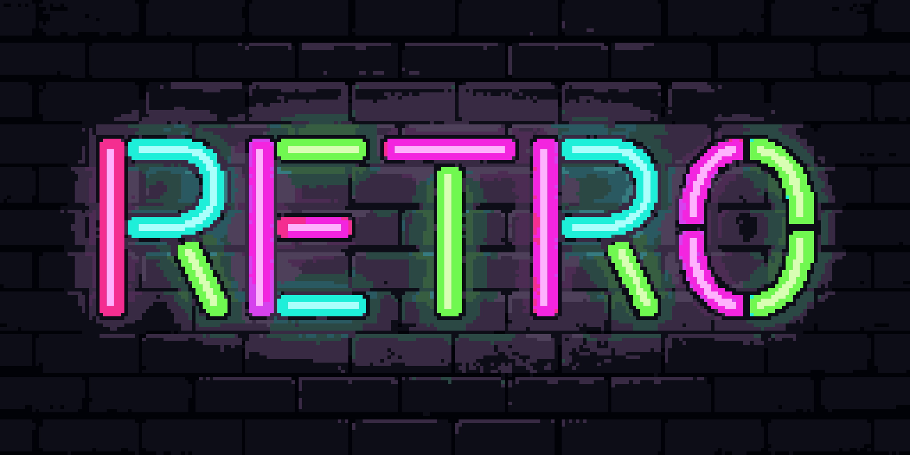<br><sub><code>rd_pro__typography</code></sub></td>
    <td align="center">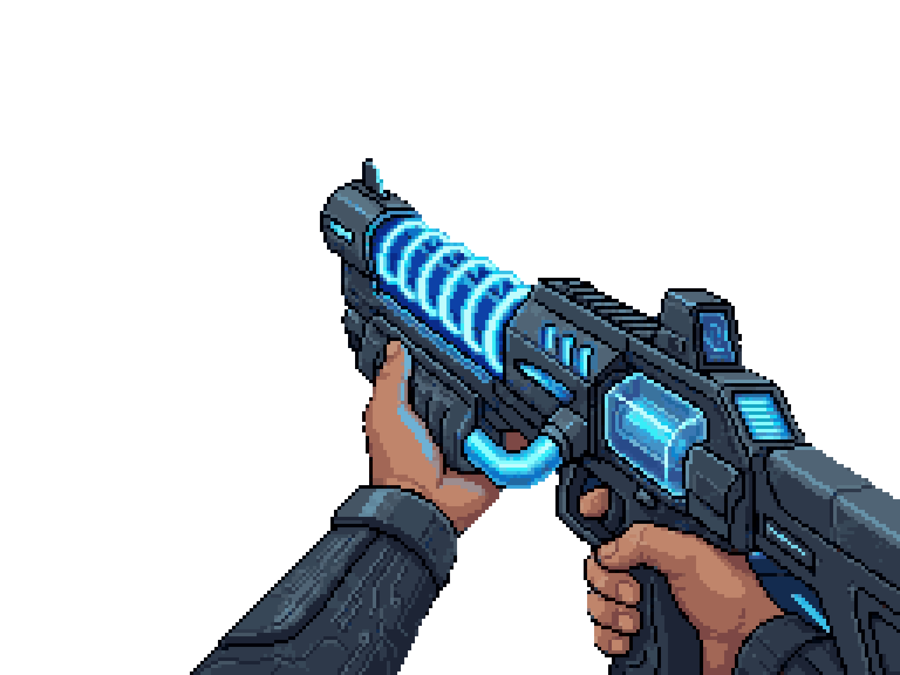<br><sub><code>rd_pro__fps_weapon</code></sub></td>
    <td align="center">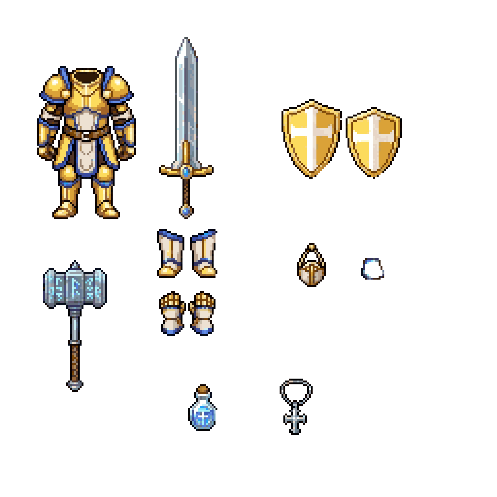<br><sub><code>rd_pro__inventory_items</code></sub></td>
  </tr>
</table>

**Your own styles:** `user__<name>_<id>` — created in
[My Styles](https://www.retrodiffusion.ai/app/my-styles) or via the [styles API](#user-styles).

## Request fields

`POST /v1/inferences`

| Field | Type | Notes |
| --- | --- | --- |
| `prompt` | string | **Required.** Describe the subject — never write "pixel art". |
| `prompt_style` | string | **Required.** A style id (see above). |
| `width`, `height` | int | **Required.** 16–512 overall; each style enforces tighter limits (most top out at 256 or 384). |
| `num_images` | int | **Required.** Batch size — up to 16 for most styles, 4 for RD Pro, 1 for animations. |
| `seed` | int | Optional. Same seed + settings ≈ same image. Omit for random. |
| `input_image` | base64 | Optional img2img source (raw base64, **no** `data:` prefix, RGB). |
| `strength` | float | 0–1, default `0.75`. How much `input_image` changes: low = subtle, high = loose. |
| `reference_images` | base64[] | RD Pro styles only: up to 9 style/content references. |
| `input_palette` | base64 | Constrain output colors to a palette image. Add `return_pre_palette` to also get the un-quantized image. |
| `remove_bg` | bool | Transparent output. Add `return_non_bg_removed` to also get the original. |
| `tile_x`, `tile_y` | bool | Seamless tiling on either axis. |
| `frames_duration` | int | Animation styles: `4`, `6`, `8`, `10`, `12`, or `16`. |
| `return_spritesheet` | bool | Animations: return a PNG spritesheet instead of a GIF. |
| `upscale_output_factor` | int | `1` (default) = native pixel size; higher = nearest-neighbor upscaled PNGs. |
| `bypass_prompt_expansion` | bool | Skip the automatic LLM prompt enrichment. |
| `include_downloadable_data` | bool | Include structured extras (e.g. `rd_pro__inventory_items` returns an item-atlas JSON). |
| `check_cost` | bool | Free dry run — returns the price, generates nothing, charges nothing. |
| `async` | bool | Queue and poll instead of waiting (see [async](#async-jobs)). |

> A `negative` field is accepted for forward compatibility but is a **placeholder — no current
> model uses it.** Describe what you *want* in `prompt` instead.

## Check cost before generating

`check_cost: true` runs a free dry run — the API returns the exact price and generates nothing.

```python
payload = {
    "prompt": "A really cool corgi",
    "prompt_style": "rd_pro__default",
    "width": 256,
    "height": 256,
    "num_images": 2,
    "check_cost": True,
}
# -> {"balance_cost": 0.36, "model": "check_cost", "base64_images": [], "remaining_balance": 100.75}
```

Check your balance any time: `GET /v1/inferences/credits` → `{"credits": 0, "balance": 100.75}`.

## Async jobs

Add `"async": true` to accept the job immediately and poll for the result — recommended for
animations and large batches. See [`07_async_batch.py`](example-scripts/07_async_batch.py).

```python
import time, requests
headers = {"X-RD-Token": "YOUR_API_KEY"}

start = requests.post(
    "https://api.retrodiffusion.ai/v1/inferences",
    headers=headers,
    json={"prompt": "A really cool corgi", "prompt_style": "rd_pro__default",
          "width": 256, "height": 256, "num_images": 1, "async": True},
).json()
# -> {"status": "accepted", "task_id": "8d24...", "message": "Inference accepted. Poll ..."}

task_id = start["task_id"]
while True:
    task = requests.get(
        f"https://api.retrodiffusion.ai/v1/inferences/tasks/{task_id}", headers=headers
    ).json()
    if task["status"] in ("pending", "running"):
        time.sleep(2)
        continue
    if task["status"] == "succeeded":
        result = task["result"]   # same shape as a synchronous response
    else:
        print("failed:", task["error"])
    break
```

## Images in: img2img, references, and palettes

All image inputs are **raw base64 with no `data:image/png;base64,` prefix**, RGB without
transparency, and palette images should stay well under 1 MB.

- **img2img** — `input_image` + `strength` (0–1): low = subtle restyle, high = loose inspiration.
  See [`03_img2img.py`](example-scripts/03_img2img.py).
- **Reference images** — RD Pro styles accept up to 9 `reference_images`. They guide *style and
  content* without being redrawn — the way to keep a consistent character across images. Generate
  the character once, then pass that output back as a reference. See
  [`04_reference_images.py`](example-scripts/04_reference_images.py).
- **Palette** — `input_palette` constrains output colors to a palette image.

<table>
  <tr>
    <td align="center">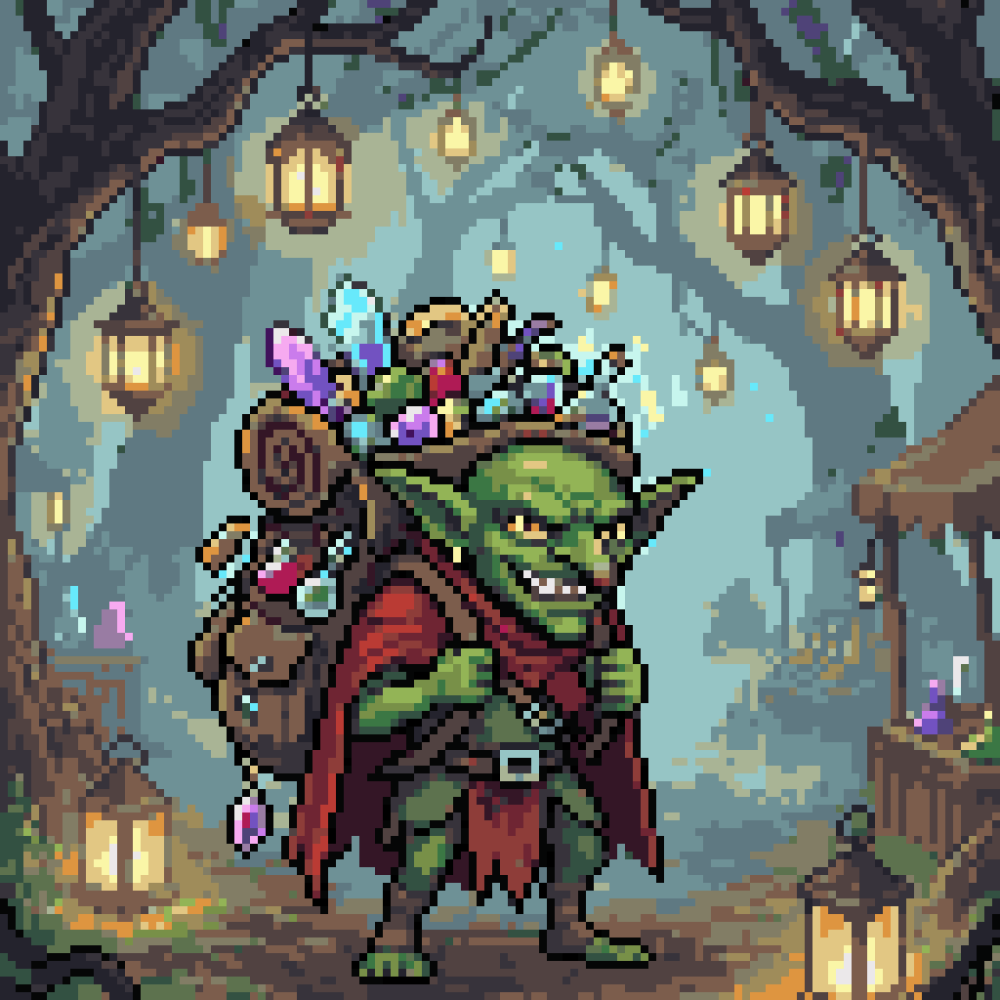<br><sub>1. generate the character</sub></td>
    <td align="center">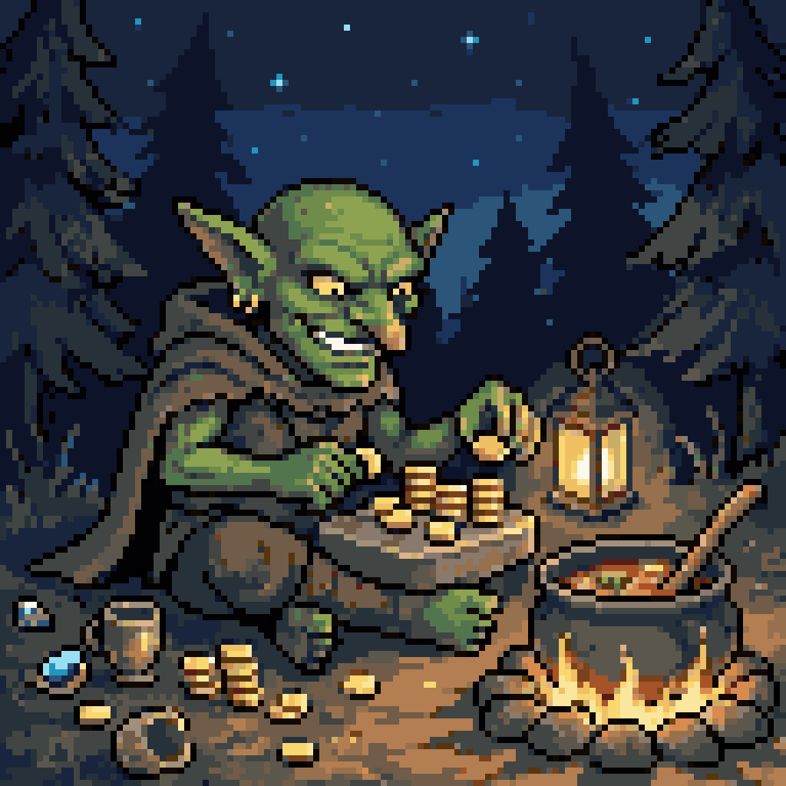<br><sub>2. reuse it as a <code>reference_image</code> in a new scene</sub></td>
  </tr>
</table>

## Animations

**Advanced animations are the most powerful workflow** — upload *any* pixel-art image as a start
frame and it comes to life. `input_image` is **required**, `width`/`height` match the frame
(32–256px), and `frames_duration` accepts 4, 6, 8, 10, 12, or 16. Output is a GIF (add
`return_spritesheet: true` for a PNG spritesheet). A neutral pose gives the best character
results. Actions: `walking`, `idle`, `jump`, `crouch`, `attack`, `destroy`, `custom_action`
(describe any motion), `subtle_motion` (ambient scene motion). See
[`05_animation.py`](example-scripts/05_animation.py).

<table>
  <tr>
    <td align="center">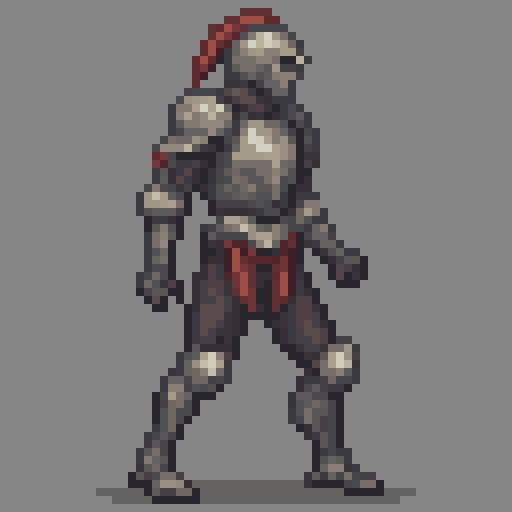</td>
    <td align="center">→</td>
    <td align="center">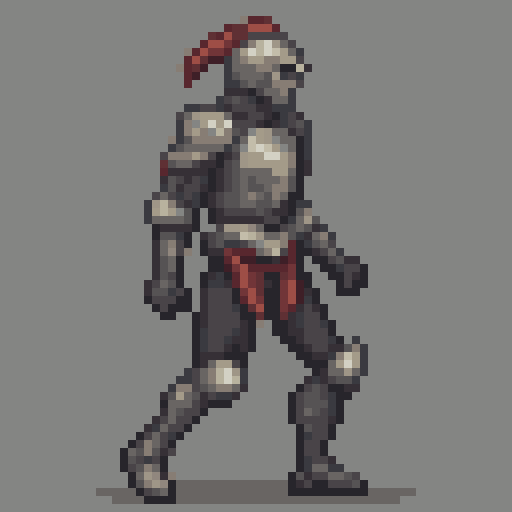<br><sub><code>rd_advanced_animation__walking</code></sub></td>
    <td align="center">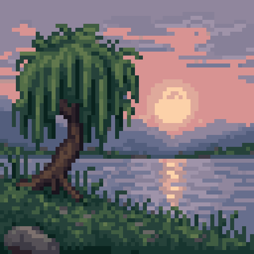</td>
    <td align="center">→</td>
    <td align="center"><br><sub><code>rd_advanced_animation__subtle_motion</code></sub></td>
  </tr>
  <tr>
    <td align="center">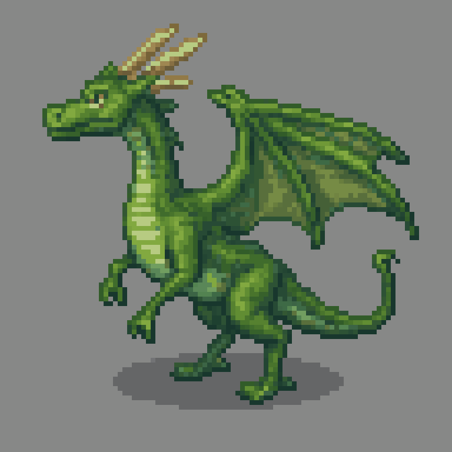</td>
    <td align="center">→</td>
    <td align="center" colspan="4">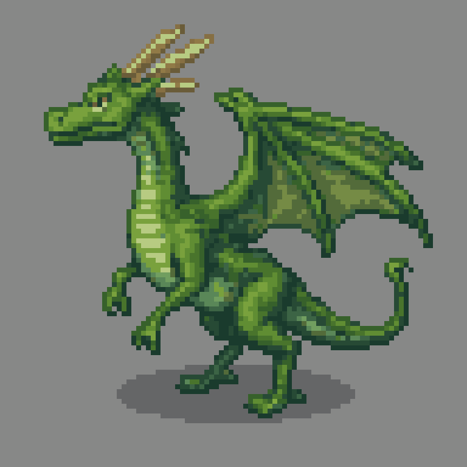<br><sub><code>rd_advanced_animation__custom_action</code> — "flapping its wings and breathing fire"</sub></td>
  </tr>
</table>

```python
payload = {
    "prompt": "slow, heavy steps",
    "prompt_style": "rd_advanced_animation__walking",
    "width": 64,
    "height": 64,
    "num_images": 1,
    "frames_duration": 8,
    "input_image": start_frame_base64,   # required
}
```

**Prompt-driven animations** produce ready-made sprite formats from just a prompt (transparent
GIF output, batch = 1):

<table>
  <tr>
    <td align="center">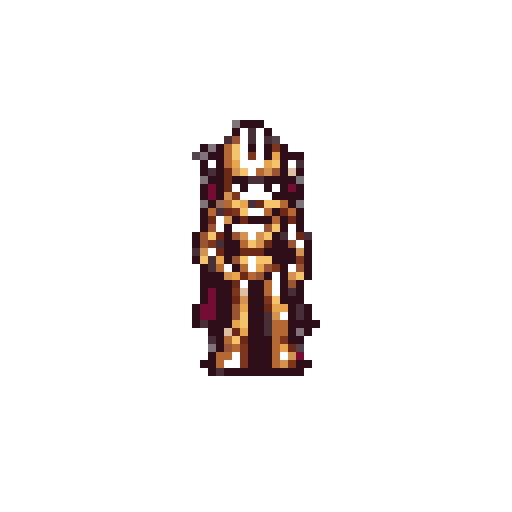<br><sub><code>rd_animation__battle_sprites</code><br>idle · walk · jump · attack</sub></td>
    <td align="center">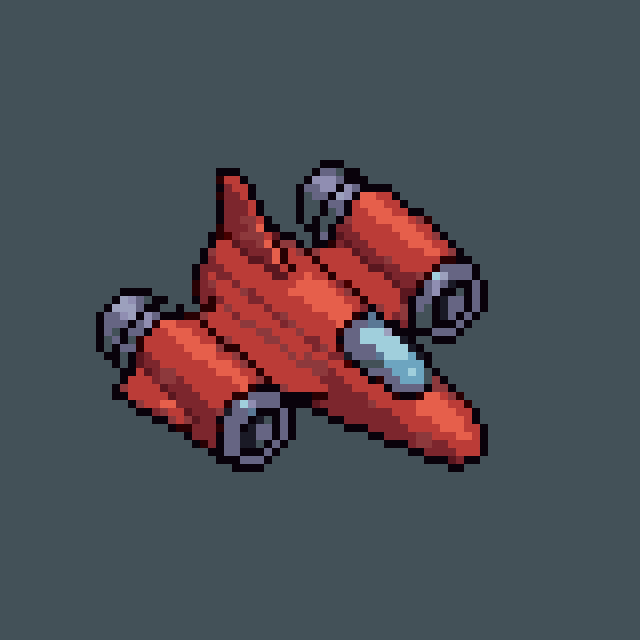<br><sub><code>rd_animation__8_dir_rotation</code></sub></td>
    <td align="center"><br><sub><code>rd_animation__vfx</code></sub></td>
  </tr>
</table>

More: `rd_animation__four_angle_walking` (48px), `rd_animation__four_angle_walking_idle` (48px),
`rd_animation__small_sprites` (32px, batch ≤ 16), `rd_animation__any_animation` (64px),
`rd_animation__big_animation` (128px).

```python
payload = {
    "prompt": "corgi wearing a party hat",
    "prompt_style": "rd_animation__four_angle_walking",  # 48x48 only
    "width": 48,
    "height": 48,
    "num_images": 1,
}
```

## Tilesets

`rd_tile__tileset` builds a full wang-style tileset from one prompt (tile size 16–32px). See
[`06_tileset.py`](example-scripts/06_tileset.py).

<table>
  <tr>
    <td align="center">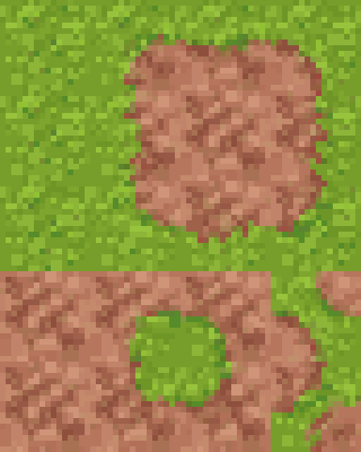<br><sub><code>rd_tile__tileset</code>, 16px tiles</sub></td>
    <td align="center">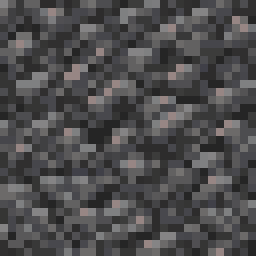<br><sub><code>rd_tile__single_tile</code></sub></td>
  </tr>
</table>

`rd_tile__tileset_advanced` takes an inside and an outside texture via `prompt` / `extra_prompt`
(and optional `input_image` / `extra_input_image`). Also: `rd_tile__single_tile` (16–64px),
`rd_tile__tile_variation` (16–128px, input image required), `rd_tile__tile_object` (16–96px),
`rd_tile__scene_object` (64–384px).

## Pricing

Cost depends on style family, resolution, and image count. `check_cost` is always authoritative
and free; these formulas are current at the time of writing:

- **`rd_fast`:** `max(0.015, (w*h + 100000) / 6000000) * num_images`
- **`rd_plus`:** `max(0.025, (w*h + 50000) / 2000000) * num_images`
- **Low-res styles** (`mc_*`, `low_res`, `classic`, `skill_icon`, `topdown_item`, tile variants):
  `max(0.02, (w*h + 13700) / 600000) * num_images`
- **`rd_pro`:** `0.18 * num_images`
- **Advanced animations:** `0.14` (`custom_action` and `subtle_motion`: `0.25`)
- **Animations:** `0.07` (`any_animation` and `8_dir_rotation`: `0.25`)
- **Tilesets** (`rd_tile__tileset` / `_advanced`): `0.10`

Credits cannot be purchased through the API. Keep long runs alive with auto-refill (Payment
Methods), or ask about monthly invoicing for teams/enterprise via
[Discord](https://discord.gg/retrodiffusion) or support@retrodiffusion.com.

## Edit tools

Edit tools post-process one image and return one edited image. Their canonical request and
response fields use `snake_case`, matching `/v1/inferences`. See the
[canvas edit tools guide](EDIT_TOOLS.md) and the runnable
[`09_edit_tools.py`](example-scripts/09_edit_tools.py) example.

- `GET /v1/edit/tools` — the authoritative list of currently available tools, their fields, and costs.
- `POST /v1/edit/tools/{tool_id}` — run a tool.
- `POST /v1/edit/tools/{tool_id}/estimate` — cost and time estimate without running.

| Tool | Cost | Key inputs |
| --- | --- | --- |
| `image_edit` | $0.18 | `input_image` (≤256px), `prompt`, `seed?` |
| `inpainting` | $0.18 | `input_image`, `prompt`, `mask_image` |
| `outpainting` | $0.18 | `input_image`, `expand_left/right/top/bottom` |
| `seam_tiling` | $0.18 | `input_image`, `tile_x`, `tile_y`, `seam_width` |
| `background_remover` | $0.01 | `input_image`, `transparency_threshold?`, `force_solid_pixels?` |
| `color_style_transfer` | $0.01 | `input_image`, `extra_input_image` |
| `color_reducer` | Free* | `input_image`, `color_count?`, `dither_mode?`, `dither_strength?` |
| `palette_converter` | Free* | `input_image`, `input_palette`, `dither_mode?`, `dither_strength?` |
| `k_centroid_downscale` | Free* | `input_image`, `width`, `height` |
| `pixel_correction` | Free | `input_image` |
| `rotate` | Free | `input_image`, `rotation_degrees?` |

For inpainting, use a same-size RGBA PNG mask with transparent protected
pixels and opaque editable pixels. A true grayscale mask also works: black is
protected and values greater than `12` are editable. A fully opaque RGB/RGBA
mask selects the entire image. See [the mask format guide](EDIT_TOOLS.md#inpainting-mask-format)
for a complete example.

\* Some free tools require a minimum account value; check `requires_minimum_balance` in
`GET /v1/edit/tools`. Paid tools charge before running and refund on failure. Responses include
`base64_images`, `output_urls`, `balance_cost`, `charged`, and `remaining_balance`.

## Pixel Fixer

Pixel Fixer restores enlarged, softened, AI-rendered, or compressed pixel art to its detected
native grid. It is free and returns only one raw base64 PNG:

```python
from rd_client import fix_pixel_art, image_to_base64, save_images

result = fix_pixel_art(input_image=image_to_base64("soft-sprite.png"), engine="standard")
save_images(result, "fixed-sprite")
```

- `POST /v1/pixel-fixer/standard` — native Rust detector and reconstructor.
- `POST /v1/pixel-fixer/neural` — neural reconstruction with optional positive target `width` and
  `height` values.
- Both accept exactly one PNG/JPEG source as raw base64, a data URI, or a public HTTPS
  `image_url`, cost nothing, and share a per-token limit of 10 requests per minute.
- Decoded sources may contain up to 16 megapixels. Base64 requests are capped at 900,000
  serialized bytes; URL downloads are capped at 20 MB and bypass that request-body limit.

See [`PIXEL_FIXER.md`](PIXEL_FIXER.md) for the exact contract, limits, errors, and runnable example.

## User styles

Create, update, and delete custom styles built on the RD Pro reference-image template. Fields
outside the template are rejected.

```python
payload = {
    "name": "My RD Pro Style",                 # required
    "description": "A polished look for item art",
    "style_icon": "sparkles",
    "reference_images": ["<base64>"],          # max 1 via the API
    "user_prompt_template": "Pixel art styled {prompt}, with 1px outlines.",  # must contain {prompt}
    "force_palette": False,
    "force_bg_removal": False,
    "min_width": 192,                          # optional forced size; both together, 64-256
    "min_height": 192,
}
# POST /v1/styles -> {"prompt_style": "user__my_rd_pro_style_1a2b3c4d", ...}
# use that prompt_style in /v1/inferences.
```

`PATCH /v1/styles/{style_id}` updates (same fields, all optional); `DELETE /v1/styles/{style_id}`
removes it.

## Errors

Two shapes; handle both:

```json
{"detail": {"code": "inference_failed", "message": "Unable to run inference."}}
{"detail": [{"msg": "Not enough balance."}]}
```

| Status | Meaning |
| --- | --- |
| `400` | Invalid input (size out of range, bad image) or insufficient balance. |
| `401` | Missing or invalid `X-RD-Token`. |
| `403` | Valid token without access to the resource (also used by the credits endpoint). |
| `404` | Task or style not found (or not owned by this key). |
| `422` | Request body failed validation (wrong types, missing required fields). |
| `429` | Rate limited — respect the `Retry-After` header. |
| `500` | Temporary server-side failure — safe to retry with backoff; charges are refunded. |

Check `GET /v1/status` (no key required) before large batches.

## Help

- Full docs: https://www.retrodiffusion.ai/app/guide/api
- Discord: https://discord.gg/retrodiffusion
